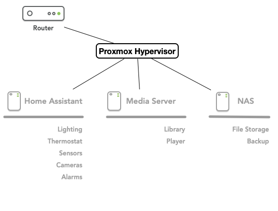

# Home Automation Project

## Summary
  In this project, I created a server to control all automated tasks inside my home, including the shared services of my home such as Network-Attached Storage and the Media Server. I used a small form factor Lenovo Thinkcentre and installed a Proxmox hypervisor on it. I then installed multiple Virtual Machines to serve as each of the functions described above. 

## Purpose

  This is a project that is ongoing in my household. I have been constantly building and re-building the home server for nearly 15 years by this point. I have had it on a large ATX box, a Raspberry Pi, and a Mac Mini. This iteration is easier in design but more complex in implementation. However, this version of the home server will add on new features.

   ### Existing Feature List
   - Media Server
   - Media Storage

   ### New Features
   - Home Automation Hub to control IoT devices and provide reports 
   - Network Attached Storage that is RAID ready for further expansion
   - UniFi controller software to control the Ubiquiti network devices present without utilizing the cloud
   - Personal VPN for use when family members are mobile

## Material List

Hardware: 
  - Lenovo Thinkcentre m970q
    - 32 GB Ram
    - 1TB SSD
    - Gigabit Internet Connection
  - 5 TB Seagate External HDD

The Thinkcentre was sourced via Amazon, but one could look on eBay for multiples if budget is a concern. However, supply chain security does need to be taken into account.

Software:
  - Proxmox Hypervisor
    - Home Assistant VM
    - Plex VM
    - OpenMediaVault VM
    - Unifi controller container

Most of these VMs and containers were taken from [Proxmox VE Helper Scripts](https://github.com/tteck/Proxmox) and modified as needed. Later iterations may just run a Docker instance for the containers (LXCs are presumably less secure), but for now the LXC runs in the hypervisor.

Services:
  - Tailscale

This will provide us the VPN capabilities. By connecting mobile users to the VPN, we can securely connect to relevant servers. Tailscale also can implement ACLs to provide a more robust network and adhere more closely to Zero Trust principles. 
  
##  Research

Resources used in this project:

[Creating a New Home Hacking Lab with Proxmox ](https://mattglass-it.com/proxmox_home_lab/)

## Design 

### Network Design

Once I dug into proxmox's internals, the project became far more complicated. With the abundance of choice afforded by the hypervisor, I had to make design decisions. How to design the architecture? Would I use an additional firewall such as pfsense or rely on Proxmox's internal firewall?

Ultimately I went with a more Agile approach - create the first iteration and then go through, test, and improve again. I implemented a simple star network structure, with each VM connected to the hypervisor and sharing the same subnet. 

The next iteration will place all the services on separate subnet behind a pfsense firewall. This will provide segmentation of this network and additional security. For now, the hypervisor firewall will act as our first line of network defense. 

### Virtual Machines

Home Assistant VM
Plex VM
OpenMediaVault VM
Unifi controller container
    
### Services

Tailscale VPN

[Tailscale](https://tailscale.com/)

## Implementation

This project went through rather smoothly. Procuring the hardware took less than a week, and the hypervisor installation was easily achieved. Proxmox was installed with no trouble, and then I began the process of installing the virtual machines and containers.
